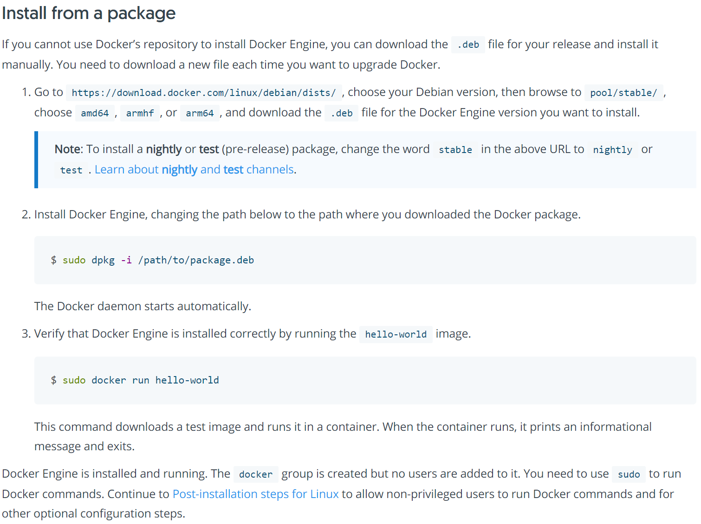
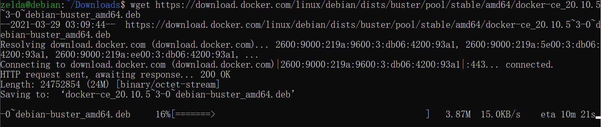
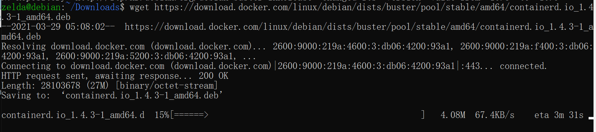
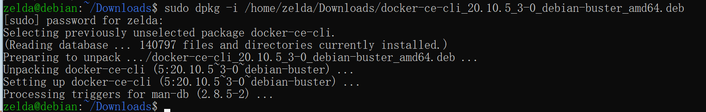
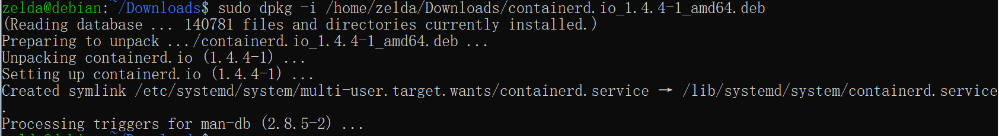
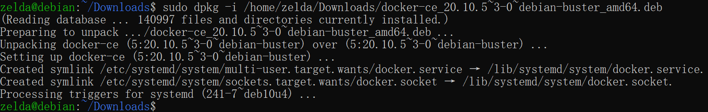
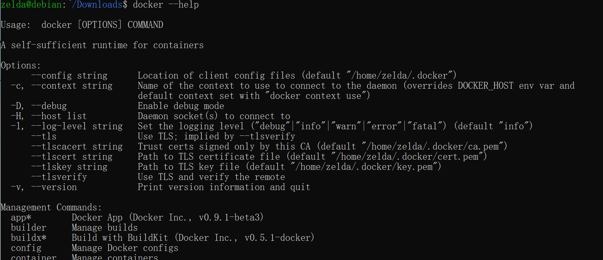
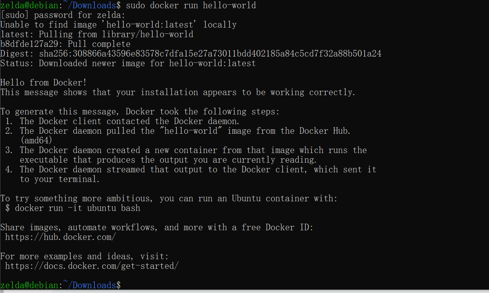

### Setup Docker
***

  
    
download docker deb file
```shell 
wget https://download.docker.com/linux/debian/dists/buster/pool/stable/amd64/docker-ce_20.10.5~3-0~debian-buster_amd64.deb
```


download contained.io deb  
```shell
wget https://download.docker.com/linux/debian/dists/buster/pool/stable/amd64/containerd.io_1.4.3-1_amd64.deb
```


download docker-ce-cli deb
```shell
wget https://download.docker.com/linux/debian/dists/buster/pool/stable/amd64/docker-ce-cli_20.10.5~3-0~debian-buster_amd64.deb
```

install `containerd.io` , `docker-ce-cli` before install deb file, 
```shell
sudo dpkg -i /home/zelda/Downloads/containerd.io_1.4.4-1_amd64.deb
sudo dpkg -i /home/zelda/Downloads/docker-ce-cli_20.10.5_3-0_debian-buster_amd64.deb
sudo dpkg -i /home/zelda/Downloads/docker-ce_20.10.5~3-0~debian-buster_amd64.deb
```




other install method check:  
[https://docs.docker.com/engine/install/debian/](https://docs.docker.com/engine/install/debian/)  

Verify that Docker Engine is installed correctly by running the hello-world image  

  

### Use Docker Command
***
```shell
#list all images -a

#list all containers
sudo docker ps -a
sudo docker container ls -a

#delete a container
sudo docker rm -f 


```

### Reference:    
[docker commands](https://docs.docker.com/engine/reference/run/)  
[docker_lauguage_set](https://docs.docker.com/language/)  
[docker_cicd](https://docs.docker.com/ci-cd/best-practices/)  