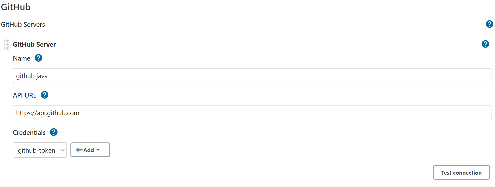
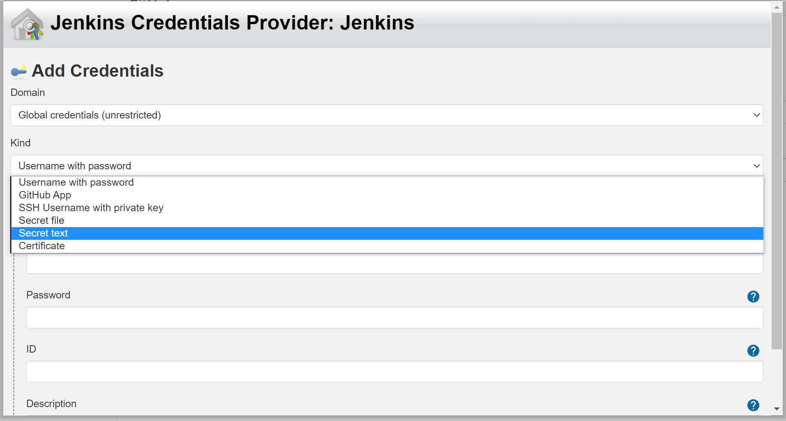
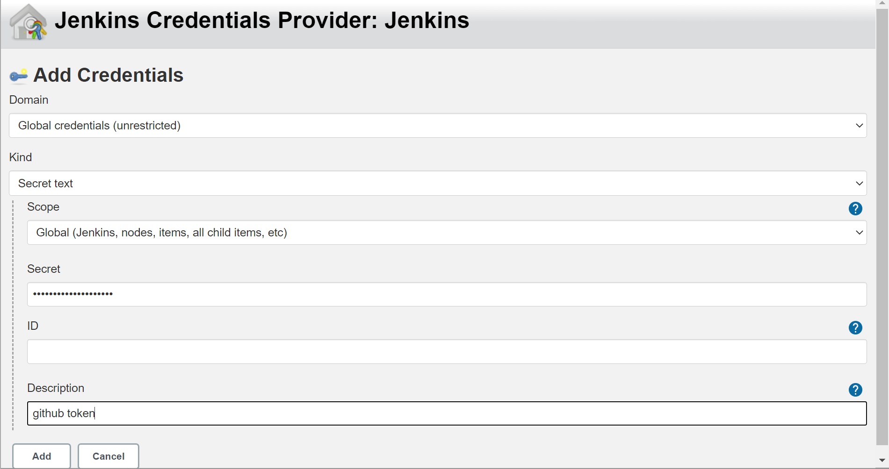
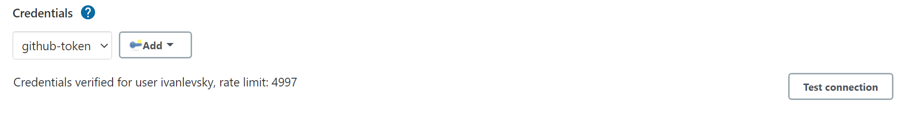

### Setup Jenkins
***
Before install jenkins, install [openjdk](../../doc/develop/java.md)  

```shell
# download jenkins from tsinghua mirror site
wget https://mirrors.tuna.tsinghua.edu.cn/jenkins/debian-stable/jenkins_2.277.1_all.deb

# install daemon,net-tools before install jenkins
sudo apt-get install daemon
sudo apt-get install net-tools

# link openjdk to user bin
sudo ln -s /home/zelda/jdk-11/bin/java /usr/bin/java

# install jenkins
sudo dpkg -i /home/zelda/jenkins_2.277.1_all.deb

# check jenkins status
sudo systemctl status jenkins

# full clean jenkins
sudo systemctl stop jenkins
sudo apt-get remove --purge jenkins
```
  
*** 
To unlock jenkins, copy the password in `/var/lib/jenkins/secrets/initialAdminPassword`
```shell
sudo more /var/lib/jenkins/secrets/initialAdminPassword
``` 
create jenkins user  
```
user:jkuser  
pass:jkpass  
```

set jenkins language, install 'locale' plugin, on dashboard: 
``` 
manage jenkins->system configuration->configure system->Locale->default language  
input 'en_US', and check 'Ignore browser preference and force this language to all users' optiion
```

set user time zone, on dashboard:  
```
people->user->configure->User Defined Time Zone->time zone
select 'Asia/Shanghai'
```

add github token
```
manage jenkins->system configuration->configure system->github
->github server
click add credentials 
```
  
```
select 'secret text'  
```
  
```
in github 'Settings->Developer settings->Personal access tokens', 
copy token to jenkins credentials secret 
```

```
click test connection to test  
```


### Pipeline
***
add github ssh key when add git url in pipeline 
