### Setup Jenkins
***
Before install jenkins, install [openjdk](../../doc/develop/java.md)  

```shell
# download jenkins from tsinghua mirror site
wget https://mirrors.tuna.tsinghua.edu.cn/jenkins/debian-stable/jenkins_2.277.1_all.deb

# install daemon,net-tools before install jenkins
sudo apt-get install daemon
sudo apt-get install net-tools

# link openjdk to user bin
sudo ln -s /home/zelda/jdk-11/bin/java /usr/bin/java

# install jenkins
sudo dpkg -i /home/zelda/jenkins_2.277.1_all.deb

# check jenkins status
sudo systemctl status jenkins

# full clean jenkins
sudo systemctl stop jenkins
sudo apt-get remove --purge jenkins
```
  
*** 
To unlock jenkins, copy the password in `/var/lib/jenkins/secrets/initialAdminPassword`
```shell
sudo more /var/lib/jenkins/secrets/initialAdminPassword
``` 
create jenkins user  
```
user:jkuser  
pass:jkpass  
```
jenkins will create a service account without shell callded 'jenkins' user in linux system, to login it use
```shell
sudo su -s /bin/bash jenkins
```

set jenkins language, install 'locale' plugin, on dashboard: 
``` 
manage jenkins->system configuration->configure system->Locale->default language  
input 'en_US', and check 'Ignore browser preference and force this language to all users' option
```

set user time zone, on dashboard:  
```
people->user->configure->User Defined Time Zone->time zone
select 'Asia/Shanghai'
```

add github token
```
manage jenkins->system configuration->configure system->github
->github server
click add credentials 
```
  
```
select 'secret text'  
```
  
```
in github 'Settings->Developer settings->Personal access tokens', 
copy token to jenkins credentials secret 
```

```
click test connection to test  
```


### Write Pipeline Script
***
check out github repo to local, use HTTPS or SSH path to clone, 
HTTPS don't need add 'credentialsId' param, when use SSH, need add 'credentialsId' param, 
check [git doc](../../doc/github/git.md) to add ssh key in github.    
add ssh private key in jenkins Credentials page, copy private key content in `'../.ssh/id_rsa'`  
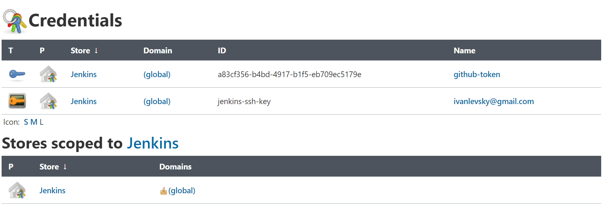

write a github checkout pipeline script
```groovy
checkout([
    $class: 'GitSCM',
    branches: [[name: '*/master']],
    extensions: [],
    userRemoteConfigs: [[   
            //https git clone
            //url: 'https://github.com/ivanlevsky/stand-alone-complex-tomato.git'
            
            //ssh git clone
            credentialsId: 'jenkins-ssh-key', 
            url: 'git@github.com:ivanlevsky/stand-alone-complex-tomato.git'
    ]]
])

```
### Pipeline Error
***
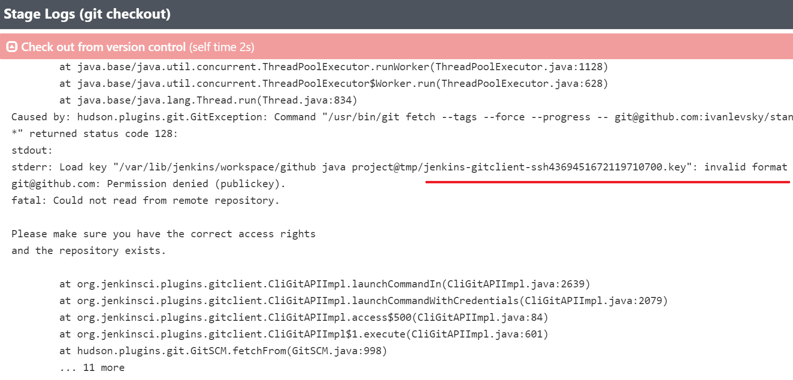  
this is a error when jenkins ssh private key content is not correct, 
the key should begin with `--BEGIN RSA PRIVATE KEY--` and end with `--END RSA PRIVATE KEY--`.    
  
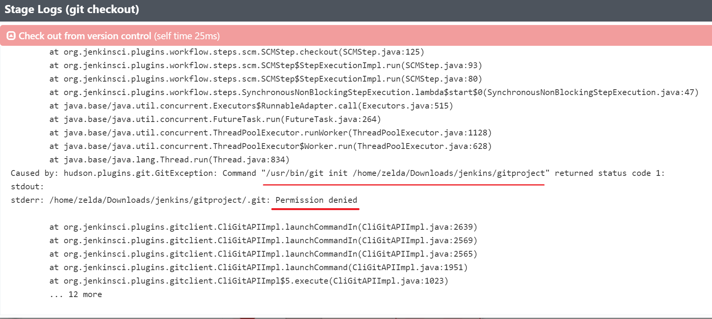  
relativeTargetDir will cause permission error, due to jenkins create a user in linux called 'jenkins'
this user don't have permissions in the relativeTargetDir targeted folder `gitproject`, the 
targeted folder's user is 'zelda'
```groovy
[$class: 'RelativeTargetDirectory', relativeTargetDir: '../../gitproject']
```  

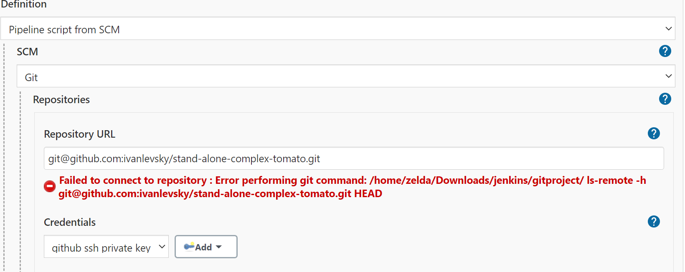  
this is a error when git path is error, use `which git` to check git path  
```
manage jenkins->system configuration->Global Tool Configuration->Git
->Git installations->Path to Git executable
input '/usr/bin/git' or just 'git'
```
  
### Set Pipeline Script In SCM
***
the pipeline script `Jenkinsfile` can upload to github, when build a project,
jenkins will download `Jenkinsfile` script from SCM
``` 
in jenkins project, configure->pipeline->definition->select 'Pipeline script from SCM'
```

add github ssh private key when add pipeline script git url in pipeline 
  

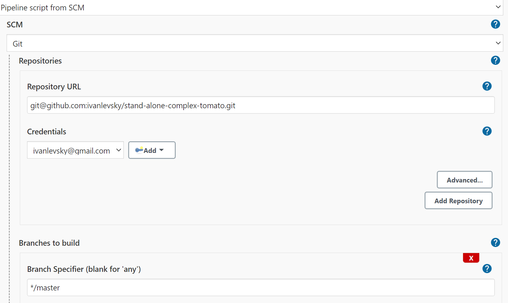
  
input script file `Jenkinsfile` relative path int git repo  
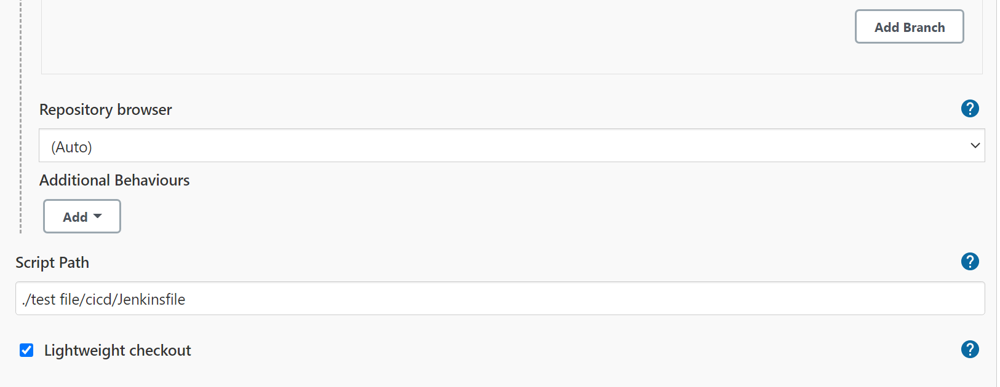
  

add Additional Behaviours 'Check out to a sub-directory', 
this not working now, see pipeline relativeTargetDir error
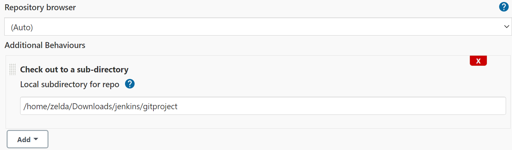
  
### Build Project
***
reset pipeline build number  
  
```groovy
item = Jenkins.instance.getItemByFullName("github java project")
//THIS WILL REMOVE ALL BUILD HISTORY
item.builds.each() { build ->
  build.delete()
}
item.updateNextBuildNumber(1)
```

set mvn home in jenkins global tool configuration
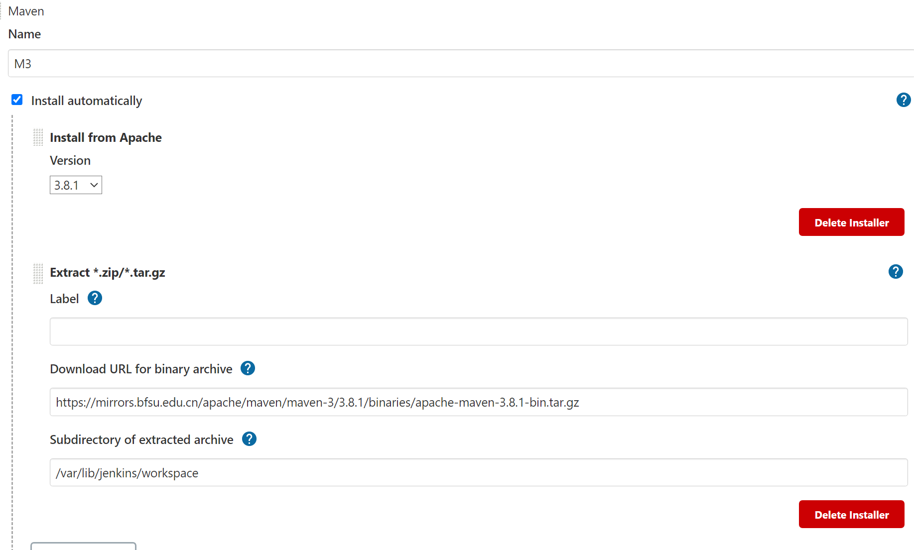
```groovy
tools {
    // Install the Maven version configured as "M3" and add it to the path.
    // After installed maven, run 'mvn help:effective-settings' command
    // to check .m2 path and install maven plugin
    maven "M3"
}

stages {
    stage('Build') {
        steps {
            // Run Maven on a Unix agent.
            sh "mvn -v"
            // skip tests and clean files in target folder, package jar
            sh 'mvn -B -DskipTests clean package'
            // run unit test classes
            sh 'mvn test'
        }
    }
}
```
### Mail Notifications
***
set jenkins user mail
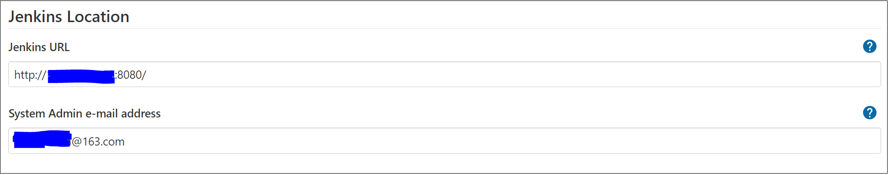
add smtp server, mail user and password
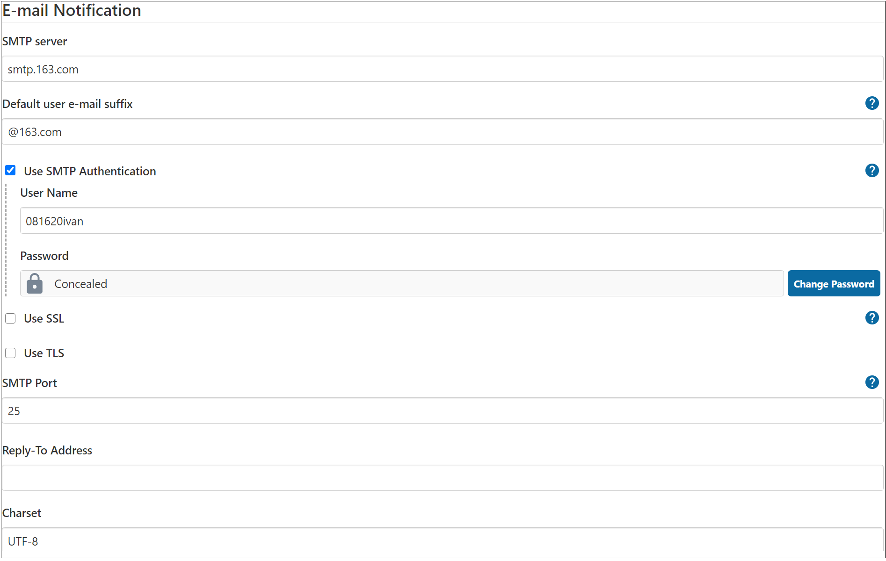
test mail connection
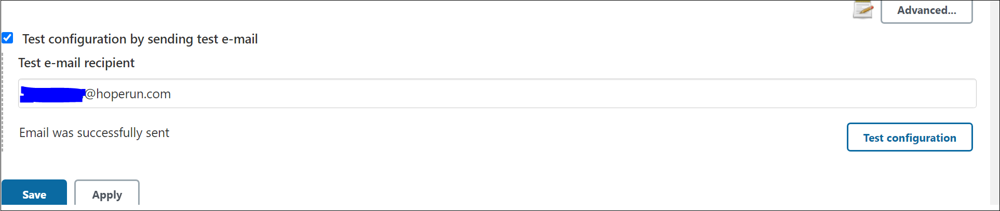