### MsgBox Function
***
```
Syntax 
      MsgBox(prompt [, buttons][, title]
         [, helpfile, context])

Key
   prompt    The dialogue box text.
   buttons   The sum of the constants for button, icon, default button and modality
   title     Title bar text
   helpfile  A helpfile to link to the help button
   context   Helpfile context number

Constants
  Buttons: vbOKOnly (0), vbOKCancel(1), vbAbortRetryIgnore (2), vbYesNoCancel(3)
           vbYesNo (4), vbRetryCancel (5)
  Icon: vbCritical (16),vbQuestion (32),vbExclamation (48), vbInformation (64) 
  Default button: vbDefaultButton1 (0),vbDefaultButton2 (256),vbDefaultButton3 (512),vbDefaultButton4(768)
  Modality: vbApplicationModal, vbSystemModal
The MsgBox function will return one of the following:

1 = OK was clicked (vbOK)
2 = Cancel was clicked (vbCancel )
3 = Abort was clicked (vbAbort)
4 = Retry was clicked (vbRetry)
5 = Ignore was clicked (vbIgnore)
6 = Yes was clicked (vbYes)
7 = No was clicked (vbNo)
```

```vb
'Display a dialogue box message
xx = MsgBox("pop up message",4,"123 title")
```
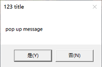  

### Date Function
***

```vb
'The current system date
xx = MsgBox(Date(),4,"Date Function")
```
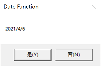   

```vb
'Return the current Date and Time  
xx = MsgBox(Now,4,"Now Function")
```
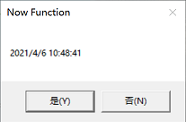  
```vb
'The current system time
xx = MsgBox(Time,4,"Time Function")
```
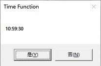 

### String Function
***
```vb
'Find one string within another
a = "123 456 abc"
xx = MsgBox(InStr(a,"a") ,4,"Instr Function")
```
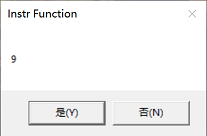  
```vb
'Return a mid-section from a string
a = "123 456 abc"
xx = MsgBox(Mid(a,5,3) ,4,"Mid Function")
```
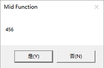 
```vb
'Return the leftmost len characters of string
a = "123 456 abc"
xx = MsgBox(Left(a,3) ,4,"Left Function")
```
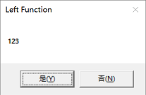
```vb
'Return the rightmost len characters of string
a = "123 456 abc"
xx = MsgBox(Right(a,3) ,4,"Right Function")
```
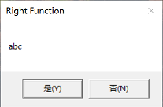
```vb
'Find and replace text
a = "123 456 abc"
xx = MsgBox(Replace(a, "abc","edf") ,4,"Replace Function")
```
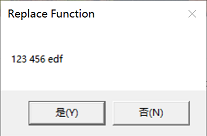


### Conditional Function
***
```vb
'Conditionally execute a block of statements.
a = 12
strtext = "a：" & a & " "
If a<0 Then  
  strtext = strtext & "< 0" 
ElseIf  a=0 Then
  strtext = strtext  & "= 0" 
Else 
  strtext = strtext &  ">0" 
End if
x=MsgBox(strtext)
``` 
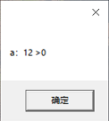

```vb
'Conditionally execute a block of statements
a = 1
strtext = "" 
d=weekday(date)
Select Case d
Case 1
strtext = strtext & ("Sunday")
Case 2
strtext = strtext &("Monday")
Case 3
strtext = strtext &("Tuesday")
Case 4
strtext = strtext &("Wednesday")
Case 5
strtext = strtext &("Thursday")
Case 6
strtext = strtext &("Friday")
Case else
strtext = strtext &("Saturday")
End Select
x=MsgBox("Today is？"&chr(10)& strtext )
```
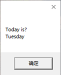

### Loop Function
***
```vb
'Repeat a block of statements a given number of times
'Step to skip number every loop
'Exit For to end loop
strtext = "" 
For i = 1 To 5 Step 2
if i = 4 Then Exit For
strtext = strtext &chr(10)& i
Next
x=MsgBox("count one to five："&strtext ,0,"For Next Function")
```
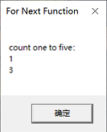

```vb
'Loop through the items in a collection or array
strtext = "" 
Dim country(2)
country(0)="china"
country(1)="japan"
country(2)="south korea"
For Each c In country
  strtext = strtext & c & ","
Next
x=MsgBox("list all countries："&strtext ,0,"For Each Function")
```
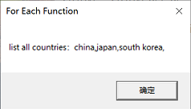

```vb
'Repeat a block of statements
a = 5
strtext = "" 
Do While a>0
a = a -1
strtext = strtext & a &","
Loop
x=MsgBox("a minus 1 every loop："&strtext ,0,"Do Loop Function")

'codes equal

a = 5
strtext = "" 
Do 
a = a -1
strtext = strtext & a &","
Loop Until a<1
x=MsgBox("a minus 1 every loop："&strtext ,0,"Do Loop Function")

```
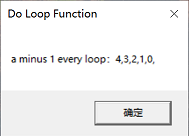

### Object Function
***
```vb
'GetObject is a wscript method, Get an Automation object
Set fileObject = GetObject("D:\1.xlsx")
Set cell = fileObject.Sheets(1).Cells(1,1)
x=MsgBox(cell,4,"Read Excel Cell")
```
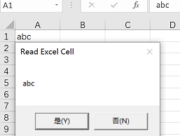

```vb
'Create an automation object / run an external command
'write text file D:\1.txt with content "123abc" 
Set objFileToWrite = CreateObject("Scripting.FileSystemObject").OpenTextFile("D:\1.txt",2,true)
objFileToWrite.WriteLine("123abc")
objFileToWrite.Close
Set objFileToWrite = Nothing
```

```vb
'Return the largest subscript for an array dimension
a = Array("abele","iefjofe","jlkkl")
x = MsgBox("a largest dimension:"& ubound(a),4,"Ubound Function")
```
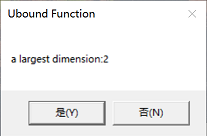


Reference:  
https://www.informit.com/articles/article.aspx?p=1187429&seqNum=5
'https://docs.microsoft.com/en-us/previous-versions//d1wf56tt(v=vs.85)
'https://ss64.com/vb/network.html
'https://docs.microsoft.com/en-us/previous-versions/ms807642%28v%3dmsdn.10%29