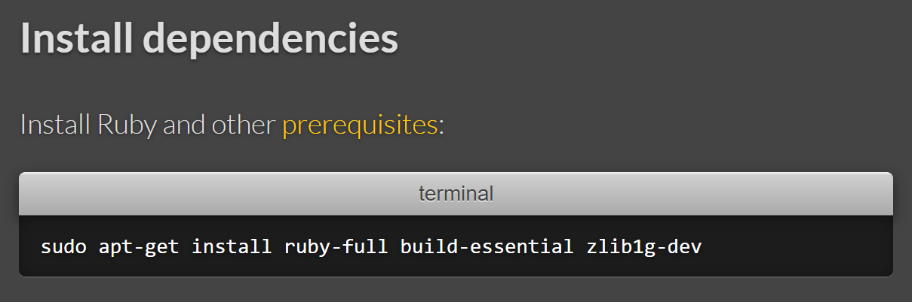
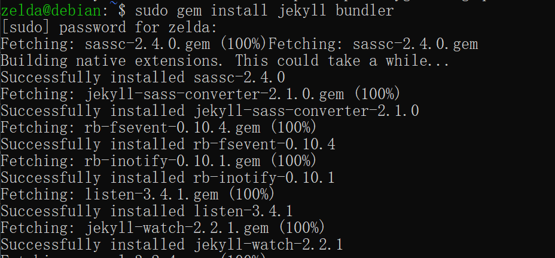
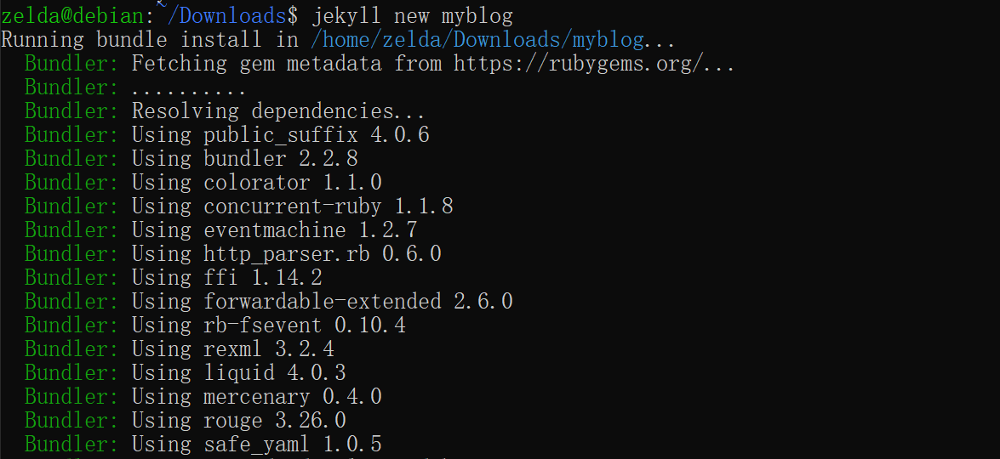
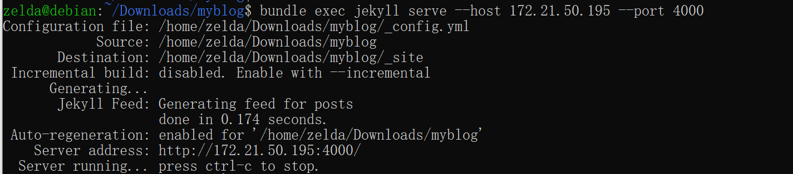
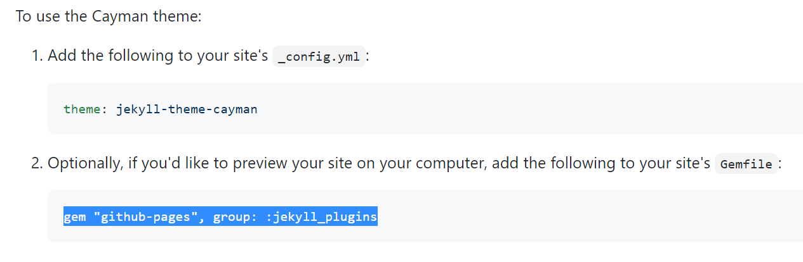
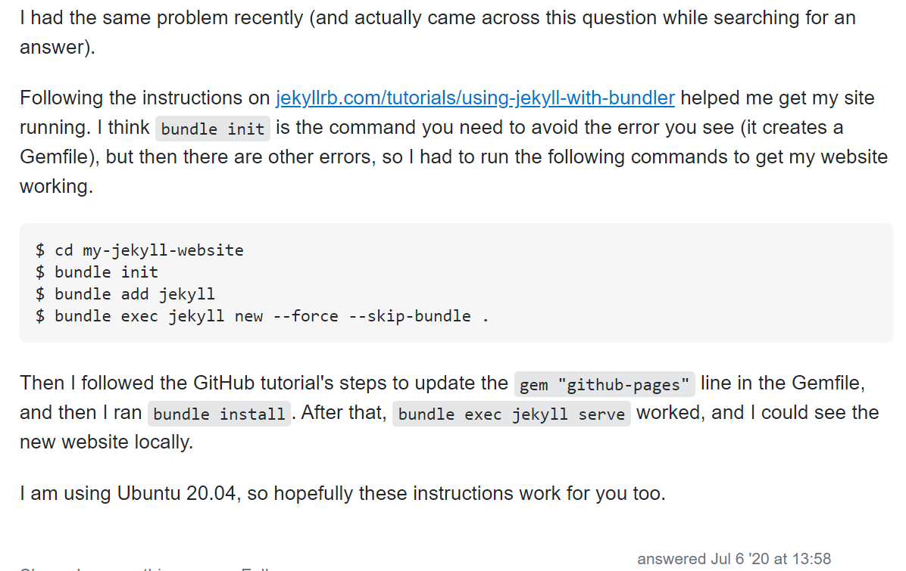
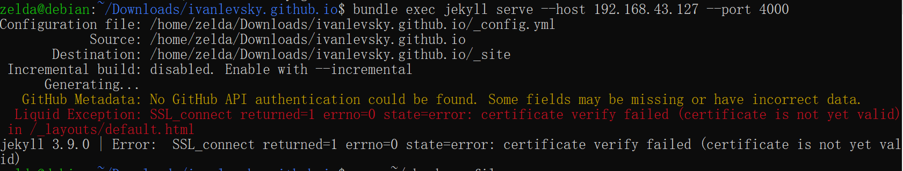

### Jekyll Setup
***
install jekyll prerequisites  
  
check prerequisites installed
```shell
# check ruby, rubygems, gcc and make installed
ruby-v
gem-v
gcc -v
g++ -v
make -v
```
install jekyll bundle  
  
create jekyll project  
  
run jekyll server
```shell 
cd myblog directory

# generate new html pages
bundle exec jekyll build

# run in http://localhost:4000
bundle exec jekyll serve

# run in http://192.168.43.127:4000/
bundle exec jekyll serve --host 192.168.43.127 --port 4000
```
  

install jekyll theme, use `gem install github-pages`   



### Debug Local Page
***
install git and clone jekyll github pages repo in jekyll server
```shell
sudo apt-get install git
git clone https://github.com/ivanlevsky/ivanlevsky.github.io.git
```

generate gem file, use `bundle init`


upload local files to remote Jekyll Server  
cd local github pages path `D:\..\IdeaProjects\ivanlevsky_github_io\`

```shell
sftp zelda@xxx.xxx.xxx.xxx
cd /home/zelda/Downloads/ivanlevsky.github.io
put -r ./index.md
cd /home/zelda/Downloads/ivanlevsky.github.io/doc
put -r ./doc
cd /home/zelda/Downloads/ivanlevsky.github.io/images
put -r ./images
```

### Error Fix
***

follow this instruction:
[https://idratherbewriting.com/documentation-theme-jekyll/mydoc_install_jekyll_on_mac.html#githuberror](https://idratherbewriting.com/documentation-theme-jekyll/mydoc_install_jekyll_on_mac.html#githuberror)
```shell 
# in debian home folder
cd ~
# generate token in github develop setting/ Developer settings/Personal access tokens's page
echo "export JEKYLL_GITHUB_TOKEN=ghp_v*********WmC" > .bash_profile
# download cacert.pem file in https://curl.haxx.se/ca/cacert.pem add following text add in .bash_profile
export SSL_CERT_FILE=/home/zelda/Downloads/ivanlevsky.github.io/cacert.pem
source ~/.bash_profile
# restart jekyll server
bundle exec jekyll serve --host 192.168.43.127 --port 4000
# add this text in the top of .bash_profile
if [ -f ~/.bashrc ];then
     source .bashrc
fi
```

Reference:  
[https://github.com/jekyll/jekyll](https://github.com/jekyll/jekyll)  
[https://jekyllrb.com/docs/installation/](https://jekyllrb.com/docs/installation/)  
[https://github.com/pages-themes/cayman](https://github.com/pages-themes/cayman)  
