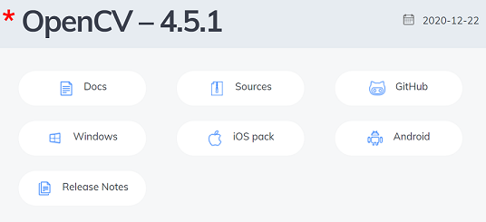
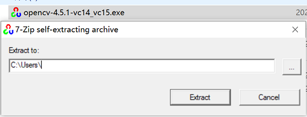
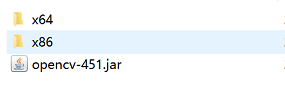

### SET UP OPENCV
***
open [official release site](https://opencv.org/releases/)  
click [windows](https://sourceforge.net/projects/opencvlibrary/files/4.5.1/opencv-4.5.1-vc14_vc15.exe/download) 
to download or go to [github release page](https://github.com/opencv/opencv/releases/tag/4.5.1) download last release  
  
download `opencv-4.5.1-vc14_vc15.exe`, extract it  
  

add java library in folder `opencv\build\java`, add files below  


add python opencv library in pip
```shell
pip install opencv-contrib-python
```


reference links:  
https://www.pyimagesearch.com/2017/07/10/using-tesseract-ocr-python/   
https://www.pyimagesearch.com/2015/11/30/detecting-machine-readable-zones-in-passport-images/    
https://github.com/cisco/openh264/releases  
https://code.tutsplus.com/tutorials/how-to-build-a-python-bot-that-can-play-web-games--active-11117  
https://blog.csdn.net/weixin_43046653/article/details/83277827  
https://www.dyclassroom.com/image-processing-project/how-to-convert-a-color-image-into-grayscale-image-in-java  
http://www.labbookpages.co.uk/software/imgProc/otsuThreshold.html  
