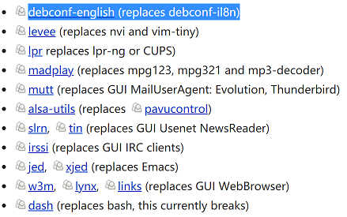
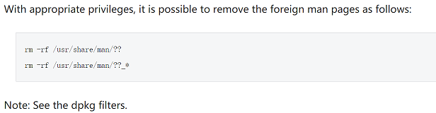

## Debian Reduce System Size
***
1. Remove non-critical packages  
  
2. Replace packages with smaller equivalents  
  
3. Remove other language man files  
  

## Close Gnome Desktop
***  
login into tty3 text terminal mode (press `CTRL+ALT+F3`)  

```shell
#stop gnome graphic login program  
systemctl stop gdm
#check gdm status
systemctl status gdm
#get debian system start mode(gui:graphical.target)
systemctl get-default
```

## Network  
***
reset net ip
```shell
nmcli networking off
nmcli networking on
```
check ip
```shell
ip a
```

ftp server setup
```shell
sudo apt install vsftpd
#backup vsftp conf file
sudo /etc/vsftpd.conf /etc/vsftpd.conf.bak

#setup vsftp
sudo vi /etc/vsftpd.conf

#set anonymous_enable
anonymous_enable=YES

#uncomment line
write_enable=YES 

#change default port
#uncomment line
connect_from_port_20=YES
#add line
listen_port=21

#uncomment three lines
chroot_local_user=YES
chroot_list_enable=YES
chroot_list_file=/etc/vsftpd.chroot_list 

#add ftp user, add ftpuser in vsftpd.chroot_list 
sudo vi /etc/vsftpd.chroot_list
#add linux user ftpuser/ftpuserpasswd 
sudo adduser ftpuser 

#check user
more /etc/vsftpd.chroot_list

#check vsftpd conf
sudo cat /etc/vsftpd.conf | grep -v "^#"

#restart VSFTPD service and check the status
sudo systemctl restart vsftpd
sudo systemctl status vsftpd
```

## System
***
restart, stop, start, check status services
```shell
sudo service mysqld restart
sudo service mysqld stop
sudo service mysqld start
sudo service mysqld status

sudo systemctl restart mysqld
sudo systemctl stop mysqld
sudo systemctl start mysqld
sudo systemctl status mysqld
```  


## Reference:  
[https://wiki.debian.org/ReduceDebian](https://wiki.debian.org/ReduceDebian)  
[https://wiki.debian.org/FTP ](https://wiki.debian.org/FTP)  
[https://wiki.debian.org/vsftpd](https://wiki.debian.org/vsftpd)  
