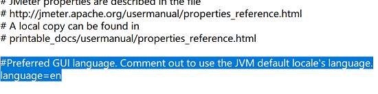
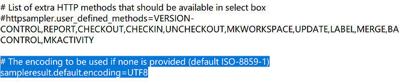
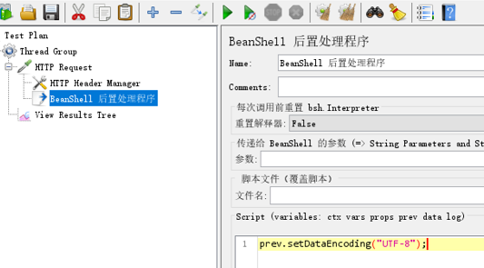

### Install Jmeter
***
download from website:  
[https://jmeter.apache.org/download_jmeter.cgi](https://jmeter.apache.org/download_jmeter.cgi)  

### Setup Jmeter
***
change jmeter properties file `apache-jmeter-5.X\bin\jmeter.properties`  
    
set default language  

fix http return content encoding(or add beanshell)  

    
  

### Jmeter Plugin
***
install plugin manager:  
[https://jmeter-plugins.org/wiki/PluginsManager/](https://jmeter-plugins.org/wiki/PluginsManager/)

